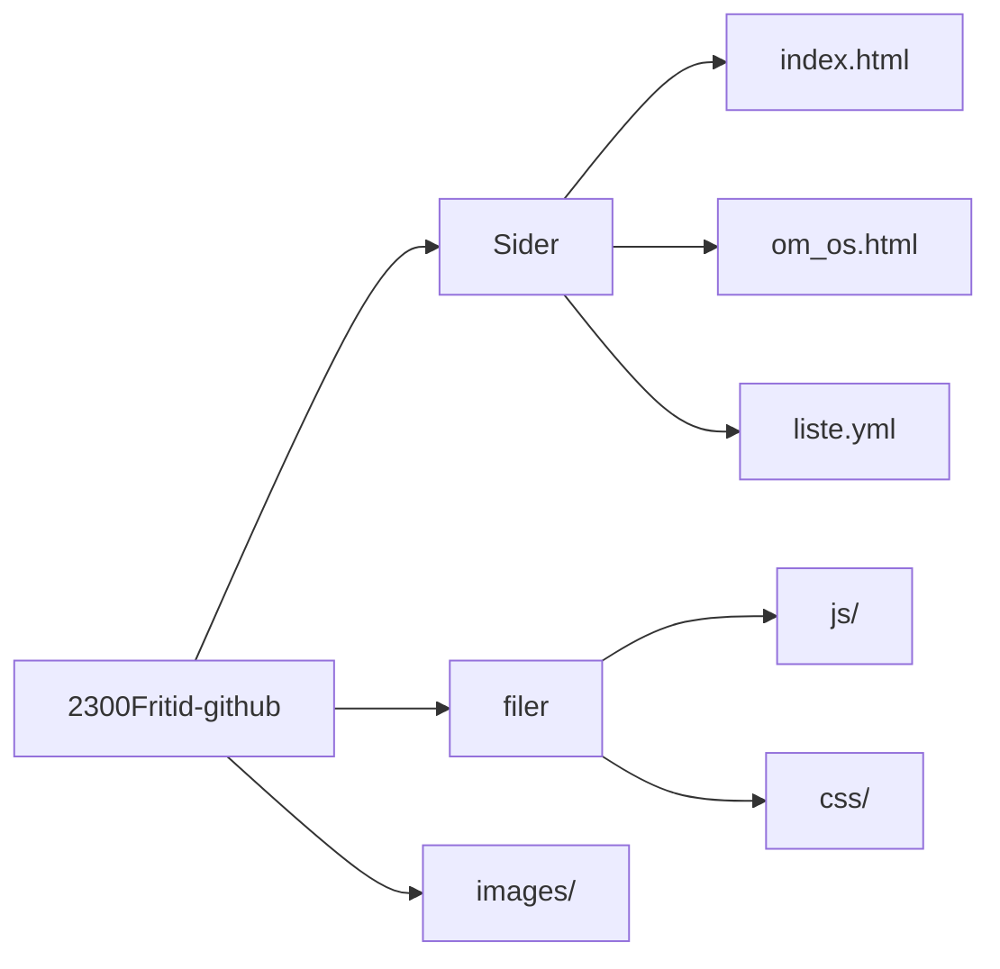

# 2300Fritid.github.io

## Tiltænkt struktur

```mermaid
graph LR
    Root[2300Fritid-github] --> Sider
    Sider --> A[index.html]
    Sider --> B[om_os.html]
    Sider --> C[liste.yml]
    Root --> Style[filer]
    Style --> D[js/]
    Style --> E[css/]
    Root --> F[images/]
```
